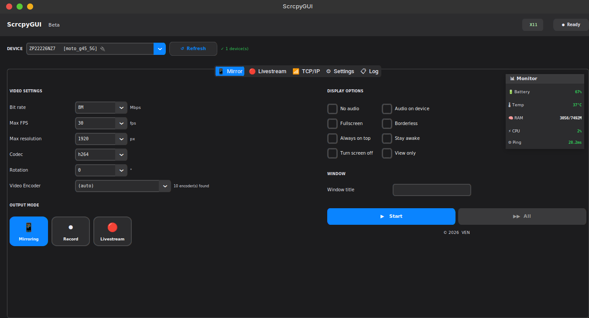
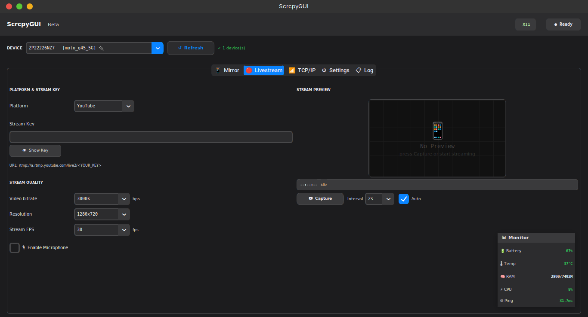
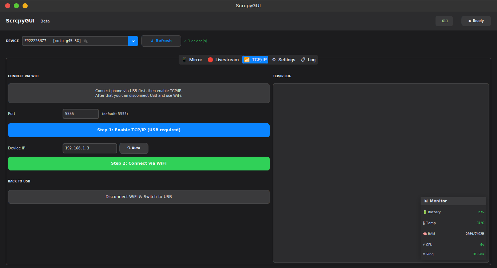
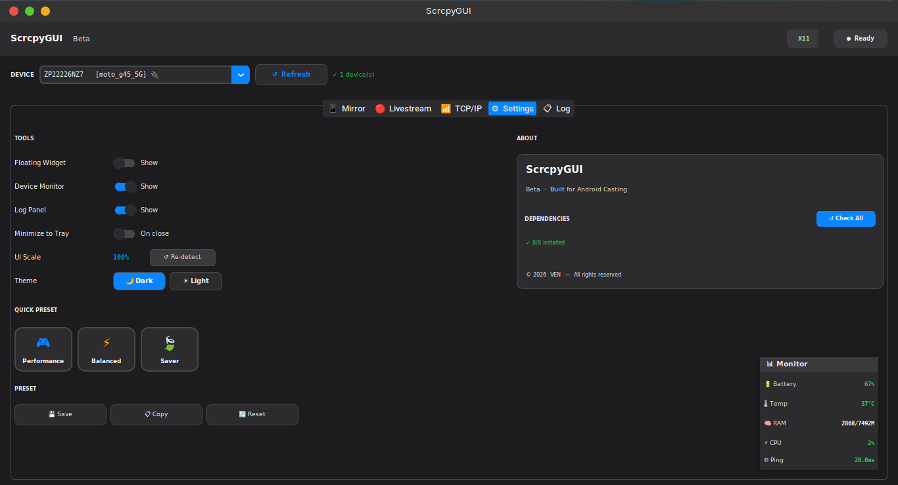
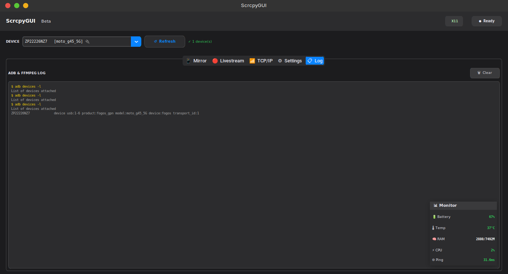

# ScrcpyGUI

A simple graphical interface for [scrcpy](https://github.com/Genymobile/scrcpy) by Genymobile.  
Built with Python + CustomTkinter. Tested on **Linux Mint 22.3**.

> ⚠️ This project is not affiliated with or endorsed by the scrcpy project or Genymobile.

---

## Preview

| | |
|---|---|
|  |  |
|  |  |
|  | |

---

## Features

- 📱 Mirror & control Android device
- 🔴 Livestream directly to YouTube (no OBS needed)
- 📶 Wireless connection via TCP/IP (WiFi)
- 📷 Screenshot via ADB
- 🎙️ Game audio only or mixed with microphone
- 🪟 Floating widget for quick access
- 📋 ADB & ffmpeg log panel

---

## Requirements
> Reminder: This project is still in Beta. We encourage you to use virtual enviroment and avoid any system-wide breaking packages (especially if youre in Linux)

### Linux dependencies
```bash
sudo apt install -y scrcpy ffmpeg adb xdotool python3 python3-venv xvfb
```
Then initiate a virtual enviroment on your current (working) folder. In this example `.venv` is a folder of the enviroment
```bash
python3 -m venv .venv
source .venv/bin/activate
```
### Python dependencies
```bash
pip install customtkinter pillow
```

---

## Development

### VS Code Setup
The project includes VS Code workspace settings (`.vscode/settings.json`) configured for:
- Python interpreter: `/usr/bin/python3` (system Python)
- Pylance language server with proper import resolution
- Basic type checking and auto-import completions

If Pylance shows import errors, ensure VS Code is using the correct Python interpreter by checking the status bar or running `Python: Select Interpreter` command.

### Project Structure
```
scrcpygui-main/
├── core/           # Core modules (config, adb_manager)
├── ui/             # UI modules (main_window)
├── main.py         # Application entry point
├── screenshots/    # Documentation screenshots
└── .vscode/        # VS Code workspace settings
```

---

## Usage
> Remember: Activate your virtual enviroment beforehand
```bash
python3 main.py
```
## Exit
```bash
deactivate
```

---

## Livestream Pipeline

```
Android → scrcpy → x11grab → ffmpeg → RTMP → YouTube
```

---

## Platform Support

| Platform | Status |
|----------|--------|
| Linux Mint / Ubuntu | ✅ Tested |
| Other Debian-based | ⚠️ Should work |
| Arch / Fedora | ❓ Untested |
| Windows / macOS | ❌ Not supported |

---

## Status

🚧 Beta — personal side project, updated when time allows.  
Bug reports and suggestions are welcome!

---

## Credits

- [scrcpy](https://github.com/Genymobile/scrcpy) — core engine
- [CustomTkinter](https://github.com/TomSchimansky/CustomTkinter) — UI framework
- [ffmpeg](https://ffmpeg.org) — stream encoding
- Android Debug Bridge (ADB) — device communication
---

## License

This project is licensed under the GNU General Public License v3.0 (GPL-3.0).

You are free to use, modify, and distribute this software as long as the source remains open and credit is given.

---

*Made with curiosity and free time after work. 😄*
